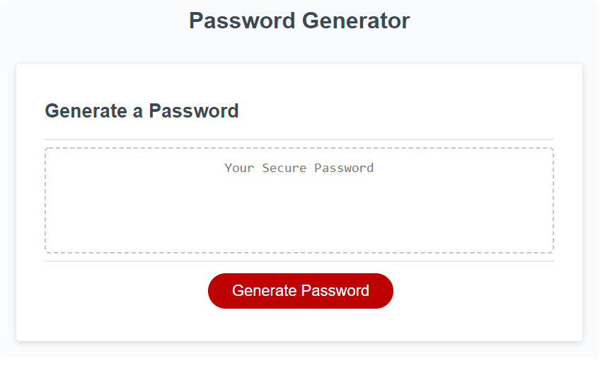

# Password-Generator

## Description
This application enables employees to generate random passwords based on criteria that they’ve selected.

The user selects:
- password length 8-128 characters
- use of lowercase letters
- use of uppercase letters
- numbers
- special characters 

 This app will run in the browser and will feature dynamically updated HTML and CSS powered by JavaScript code.

## Error Handling 
If the user imputs a number that falls outside of the designated range, or they enter letters/special characters they will receive an alert that says "Character length has to be a number between 8-128. Please try again!"

## Credits
The source code for this project is from a-nyx in the GitLab repository that can be found [here](https://utoronto.bootcampcontent.com/utoronto-bootcamp/UTOR-VIRT-FSF-PT-02-2023-U-LOLC/-/tree/main/03-JavaScript/02-Challenge).

## License
N/A

## Assets
The following demonstrates the websites appearance:

